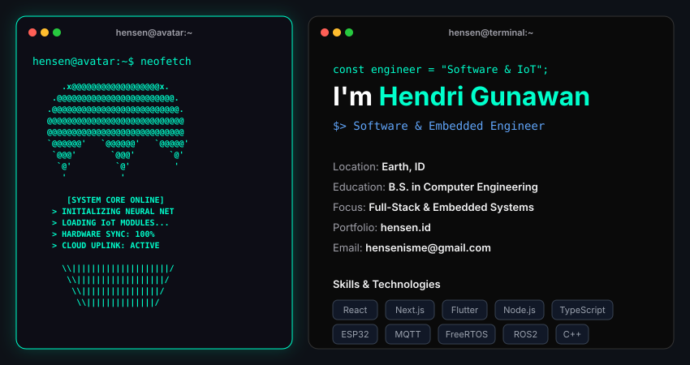

<!-- Cyberpunk / Sci-Fi Ultimate Theme README -->

  <picture>
    
  </picture>

 

## 🚀 About Me
I’m **Hendri Gunawan (Hensen)**, a Software Engineering graduate and **Full-Stack & IoT Engineer** who builds impactful, end-to-end applications beyond simple interfaces. From programming microcontrollers to deploying scalable cloud architectures.

I work with **ESP32, MQTT, React, Next.js, and Node.js**, combining creative frontend development with strong hardware/backend functionality to build scalable full-stack solutions. I’m also passionate about **Embedded Systems and Automation**, building architectures using tools like **FreeRTOS and ROS2**.

> 💡 *"Every burnt component is a lesson, and every kernel panic is an opportunity to rebuild stronger."*

- 🎓 **Education:** B.S. in Computer Engineering, Politeknik Negeri Jember.
- 💬 **Ask me about:** IoT architectures, Embedded Systems, or Full-Stack Web Development.
- ✉️ **Contact:** [hensenisme@gmail.com](mailto:hensenisme@gmail.com)
- 🌐 **Portfolio:** [hensen.id](https://hensen.id)

---

## 📈 GitHub Stats & Metrics

  <!-- GitHub Stats Card -->
  <picture>
    
  </picture>
  
  <!-- Top Languages Card -->
  <picture>
    
  </picture>

---

  Designed, thought, and developed with 💚 by <a href="https://hensen.id/" target="_blank"><b>Hensen</b></a> 
  Every line of code crafted for immersive and interactive digital experiences.

